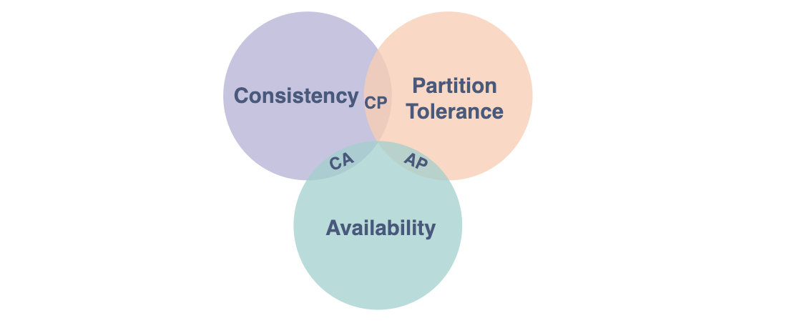
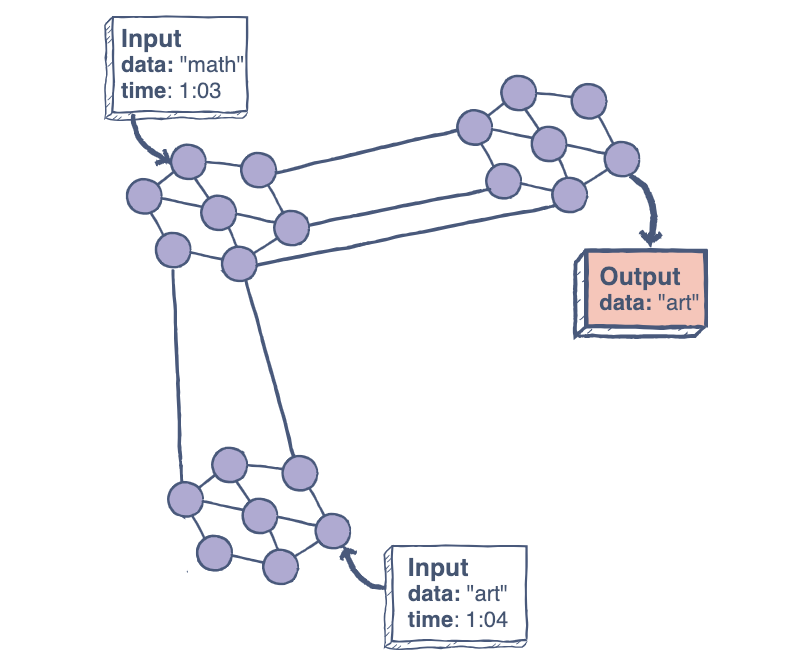
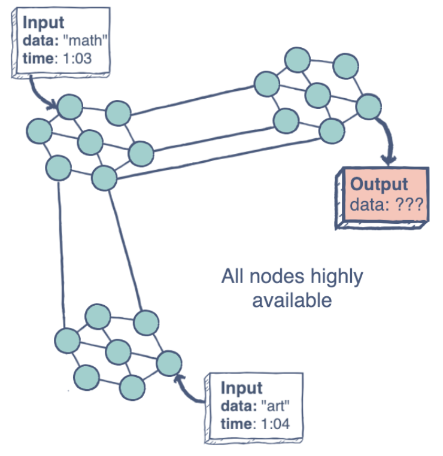

## What is CAP Theorem?

- The CAP theorem (also called Brewer’s theorem) states that a distributed database system can only guarantee two out of these three characteristics: Consistency, Availability, and Partition Tolerance.

## Consistency

- A system is said to be consistent if all nodes see the same data at the same time.
- Simply, if we perform a read operation on a consistent system, it should return the value of the most recent write operation. This means that, the read should cause all nodes to return the same data, i.e., the value of the most recent write.

## Availability

- Availability in a distributed system ensures that the system remains operational 100% of the time. Every request gets a (non-error) response regardless of the individual state of a node.
- Note: this does not guarantee that the response contains the most recent write.
- The figure on the left illustrates an “unavailable” system.

## Partition Tolerance

- This condition states that the system does not fail, regardless of if messages are dropped or delayed between nodes in a system.
- Partition tolerance has become more of a necessity than an option in distributed systems. It is made possible by sufficiently replicating records across combinations of nodes and networks.