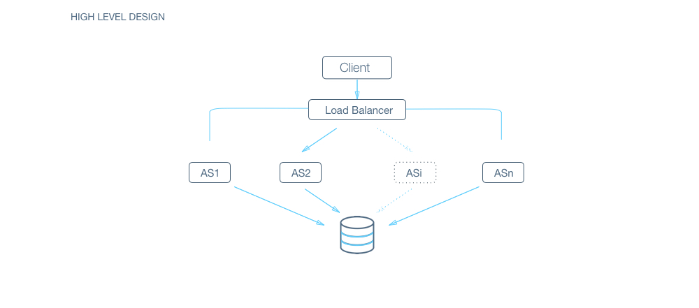

## Design a URL shortening service, like bit.ly
### Features:
- URL Shortening : Take a long url and return a much shorter url.
- Redirection : Take a short url and redirect to the original url.
- Custom url : Allow the users to pick custom shortened url.
- Analytics : Usage statistics for site owner.
    - Ex: How many people clicked the shortened url in the last day?
- Challenges : What if two people try to shorten the same URL?

### Estimation:
- Estimated numbers of how scalable our system should be. 
- Number of queries per second and the data which the system will be required to handle.
- Q: How many queries per second should the system handle? (Assuming 100 Million new URLs added each month)
    - Hint: Assuming average lifetime of a shortened URL is 2 weeks and 20% of websites creates 80% of the traffic, 
        - we see that we'll receive around 1 Billion queries in a month.
    - A: 400 queries per second in total. 
        - 360 read queries and 40 write queries per second.
- Q: How much data will we need to store so that we don't have to restructure our architecture for the next 5 years considering constant growth rate?
- Q: How many URLs will we need to handle in the next 5 years?
    - Hint: Earlier we saw, we would see 100 Million new URLs each month. 
    - Assuming same growth rate for next 5 years, total URLs we will need to shorten will be 100 Million * 12 * 5 = 6 Billion.
    - A: 6 Billion.
- Q: What is the minimum length of shortened url to represent 6 Billion URLs?
    - Hint: We will use (a-z, A-Z, 0-9) to encode our URLs. 
    - If we call x as minimum number of characters to represent 6 Billion total URLs, then will be the smallest integer such that x^62 > 6*10^9. (Base62)
    - A: Log (6*109) to the base 62 = 6
    - A: 3 TeraBytes for URLs and 36 GigaBytes for shortened URLs
    - Note that for the shortened URL, we will only store the slug(6 chars) and compute the actual URL on the fly.
- Q: Data read/written each second?
    - Hint: Data flow for each request would contain a shortened URL and the original URL. Shortened URL as we saw earlier, will take 6 bytes whereas the original URL can be assumed to take atmost 500 bytes.
    - A: Written : 40 * (500 + 6) bytes, Read : 360 * (500 + 6) bytes

### Design Goals:
- Latency 
    - Is this problem very latency sensitive 
    - (Or in other words, Are requests with high latency and a failing request, equally bad?). 
    - For example, search typeahead suggestions are useless if they take more than a second.
- Consistency - 
    - Does this problem require tight consistency? Or is it okay if things are eventually consistent?
- Availability - 
    - Does this problem require 100% availability?
    - There could be more goals depending on the problem. 
    - It's possible that all parameters might be important, and some of them might conflict. 
    - In that case, you’d need to prioritize one over the other. 
- Q: Is Latency a very important metric for us?
    - A: Yes. Our system is similar to DNS resolution, higher latency on URL shortener is as good as a failure to resolve.
- Q: Should we choose Consistency or Availability for our service?
    - A: This is a tricky one. 
    - Both are extremenly important. 
    - However, CAP theorem dictates that we choose one. 
    - Do we want a system that always answers correctly but is not available sometimes? 
    - Or else, do we want a system which is always available but can sometime say that a URL does not exists even if it does?
    - This tradeoff is a product decision around what we are trying to optimize. 
    - **Let's say, we go with consistency here.**
- Q: Try to list down other design goals?
    - A: URL shortener by definition needs to be as short as possible. 
    - Shorter the shortened URL, better it compares to competition.

### High Level Design:
- Design of your system, both in terms of API and the overall workflow of a read and write request. 
    - Workflow of read/write request here refers to specifying the important components and how they interact. 
- Q: How should we define our APIs?
    - ShorteningAPI(url) {store the url_mapping and return hash(url)}
    - RedirectionAPI(hash) {redirect_to url_mapping[hash]}
    - Both APIs are very lightweight, their computation will not be the bottleneck plus we don't have to store any session information about users.
    - Basically, we are trying to build a service which serves as a huge HashMap
- Q: How would a typical write query look like?
    - Components:
        - Client ( Mobile app / Browser, etc ) which calls ShorteningAPI(url)
        - Application server which interprets the API call and generates the shortened hash for the url
        - Database server which stores the hash => url mapping
        
- Q: How would a typical read query look like?
    - Components:
        - Client ( Mobile app / Browser, etc ) which calls RedirectionAPI(short_url)
        - Application server which interprets the API call, extracts the hash from short_url, asks database server for url corresponding to hash and returns the url.
        - Database server which stores the hash => url mapping

### Deep Dive: {Majority of time is spent here}
- How should we compute the hash of a URL?
    - How should we handle the case where two separate URL gets shortened to the same URL?
    - We can use a list of salts in case of collision.
    - For each read request, we can compute all possible shortened URLs using our list of salts and query for them in parallel to save time.
    - A: convert_to_base_62(md5(original_url + salt))[:6](first six characters)
    - Links: MD5-Wiki Base 62 Conversion-Stackoverflow
    - Gotchas:
    - Directly encoding URL to base_62 will allow a user to check if a URL has been shortened already or not, 
        - reverse engineering can lead the user to the exact hash function used, this should not be allowed. 
        - Therefore randomization has to be introduced. 
        - Also, if two users shortens the same URL, it should result in two separate shortened URL(for analytics)
    - Database ID encoded to base_62 also won't be suitable for a production environment because it will leak information about the database. 
        - For example, patterns can be learnt to compute the growth rate(new URLs added per day) and in the worst case, copy the whole database.
- Q: How would you take care of application layer fault tolerance?
- Q: How do we handle the case where our application server dies?
    - A: The simplest thing that could be done here is to have multiple application server. 
    - They do not store any data (stateless) and all of them behave the exact same way when up. 
    - So, if one of them goes down, we still have other application servers who would keep the site running. 
    
- Q: How does our client know which application servers to talk to. How does it know which application servers have gone down and which ones are still working?
    - A: We introduce load balancers. 
    - Load balancers are a set of machines (an order of magnitude lower in number) which track the set of application servers which are active ( not gone down ). 
    - Client can send request to any of the load balancers who then forward the request to one of the working application servers randomly.
    - A: If we have only one application server machine, our whole service would become unavailable. 
        - Machines will fail and so will network. 
        - So, we need to plan for those events. 
        - Multiple application server machines along with load balancer is the way to go.
- Q: What all data should we store?
    - A: Data storage layer: Hash => URL mapping.
    - Billions of small sized(1kb) object. There is no relationship between objects.
    - We would also need to store data for analytics, for example, how many times was the url opened in the last hour?
- Q: Should we choose RDBMS or NOSQL?
    - Hint : Things to consider :
        - Are joins required :
        - NoSQL databases are inefficient for joins.
        - In this case, assuming we don’t need analytics, we only need to answer the query “Given a hash, give me the corresponding URL” 
            - a standard key to value lookup. As such, we don’t need any joins here.
        - Size of the DB :
            - If the size of the data is so small that it fits on a single machine’s main memory, SQL is a clear winner. 
            - SQL on a single machine has next to zero maintenance overhead and has great performance with right index built. 
            - If your index can fit into RAM, its best to go with a SQL solution. 
    - Lets analyze our current case (Assumptions) :
        - Number of writes per month: 100 Million 
        - Avg size of URL : 500 bytes
        - Provisioning for : 5 years
        - Space required : 500 bytes * 100M * 12 * 5 = 3TB
        - 3TB of data can fit on a single machine’s hard disk. 
            - However, the index might not. 
            - If we store all data on a single machine, our write and read operations would be very slow (Page swaps for indices). 
            - Given read latency is critical for us, we can’t store the data on a single machine.
        - So, a SQL solution will have a sharding overhead. 
            - Most NoSQL solutions however are built with the assumption that the data does not fit on a single machine and hence have sharding builtin.
    - A: As discussed in hints, NoSQL would be a better fit for our case.
    - Since we are optimizing for consistency over availability, we will choose a NoSQL DB which is highly consistent like HBase.
- Q: What would the database schema look like?
    - A: We want to store the mapping from hash -> URL which is ideal for a key value store. 
    - In NoSQL domain, we need to be careful when designing the key as entries are indexed by the key.
    - In our case, since we will only query by hash which will never update, our key will be hash with the value being the URL.
- Q: How would we do sharding?
    - A: HBase inherently use consistent hashing for sharding. 
    - Since our total data size is a few TBs, we don’t need to think about sharding across datacentres either.
- Q: How would we handle a DB machine going down?
    - A: NoSQL again has single machine failure handling inbuilt. 
    - A NoSQL DB like HBase would have an availability issue for a few seconds for the affected keys, as it tries to maintain tight consistency.

### Bonus Exercise :
- Q: How can we optimize read queries?
    - Caching can be used to reduce average read time. 
    - Since most URL's are accessed for only a small amount of time after its creation, LRU cache fits our use case. 
    - Also, if a shortened URL goes viral, serving it through a cache will reduce the chances overloading the database. 
    - Redis and Memcached are examples of well known and widely used caches.
- Q: How would you shard the data if you were working with SQL DB?
    - Consistent Hashing
    - We can use integer encoding of the shortened URL to distribute data among our DB shards.
    - Assuming we assign values from 0 to 61 to characters a to z, A to Z, and 0 to 9, we can compute the integer encoding of the shortened URL.
    - We can see that the maximum value of integer encoding will be less than 10^13, which we can divide among our DB shards.
    - We will use consistent hashing to ensure we don't have to rehash all the data again if we add new DB shards later.
- Q: How would you handle machine dying in the case of SQL DB?
    - This is a bit tricky. 
    - Obviously, for every shard, we need to have more than one machine
    - We can have a scheme better known as master slave scheme, 
    - wherein there is one machine(master) which processes all writes 
    - and there is a slave machine which just subscribes to all of the writes and keeps updating itself. 
    - In an event that the master goes down, the slave can take over and start responding to the read queries.